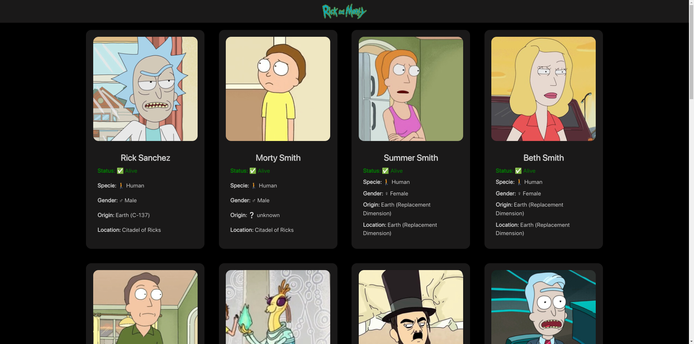

# [RickAndMorty-API](https://github.com/YeiserDeveloper/RickAndMorty-API)

## Indice

1. [Screenshots](#screenshots)
2. [Mi proseso](#mi-proceso)
3. [Gracias](#gracias)
4. [Redes](#redes)

## Screenshots

## Mi proceso

- Comence creando los archivos y carpetas que utilizaria e iniciando la configuracion de mi repositorio.
- Ya con mi cuenta creada de MovieDB para recibir la key de autenticación.
- Despues cree un modelo de como querria que quedara el resultado final. Y plasme todo lo que pude en el html guiandome de los Framework: DaisyUI y Tailwindcss.

## Gracias

Este codigo tomo tiempo y esfuerzo te agradesco por verlo. Si quieres apoyarme haslo dandome una estrella.

## Redes

Twitter: [@YeiserJiménez2](https://twitter.com/YeiserJimnez2)

Facebook: [Yeisel27](https://www.facebook.com/Yeisel27)